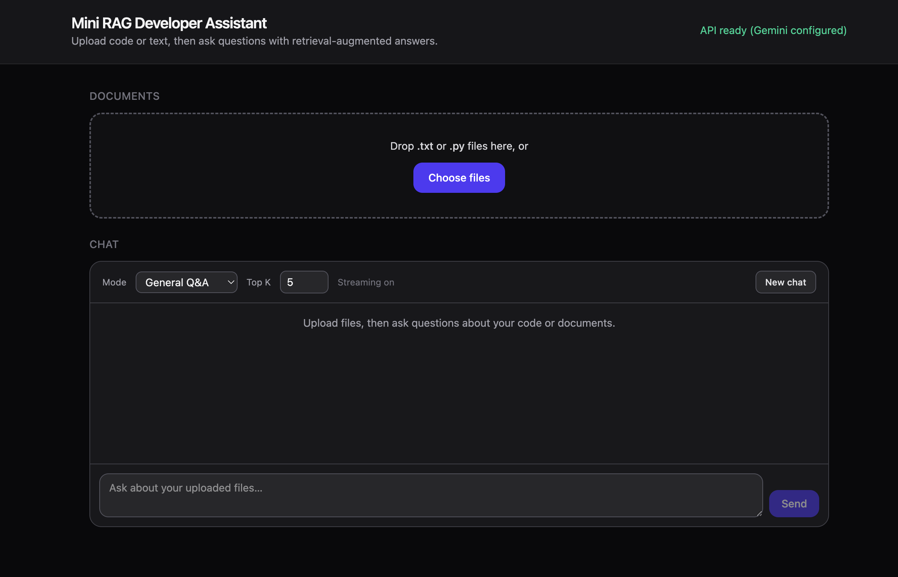
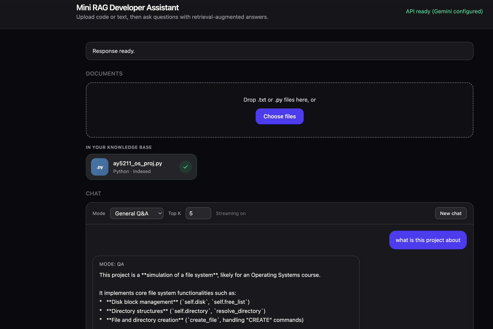
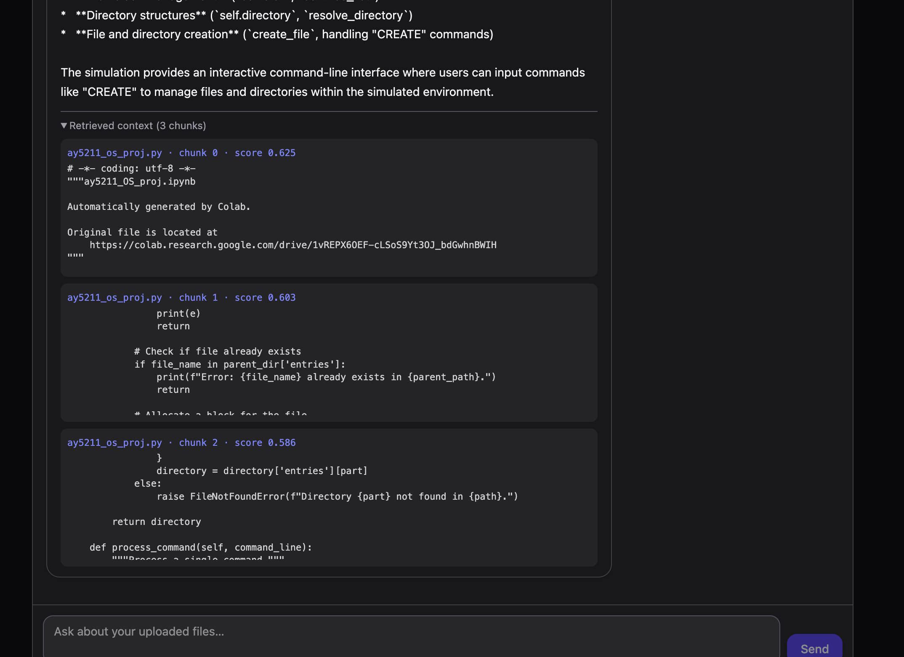

# Mini RAG-Based Developer Assistant

Full-stack app: upload `.txt` / `.py` files, index chunks with **Google Gemini embeddings** into an in-memory FAISS store, then chat with a **Gemini** model using retrieved context (RAG).

## Screenshots

### Home — upload & chat

Upload `.txt` / `.py` files, see indexed documents, and start a conversation with streaming answers.



### Ask a question

Ask about your uploaded code or text; the assistant replies with context-aware answers (streaming).



### Retrieved context

Expand **Retrieved context** to see which file chunks were used for the answer (file, score, excerpt).



## Prerequisites

- Python 3.10+
- Node.js 20+
- [Google AI Studio API key](https://aistudio.google.com/apikey) (Gemini API)

## Backend (FastAPI)

```bash
cd backend
python3 -m venv .venv
source .venv/bin/activate   # Windows: .venv\Scripts\activate
pip install -r requirements.txt
cp .env.example .env        # set GOOGLE_API_KEY
uvicorn app.main:app --reload --host 127.0.0.1 --port 8000
```

Endpoints: `GET /health`, `POST /upload` (multipart field `files`), `POST /reset` (clears in-memory FAISS index for a new session), `POST /query` (JSON, full response), `POST /query/stream` (same JSON body, **NDJSON** stream: `meta` → `delta` lines → `done`). The web UI uses streaming and a **New chat** button that resets the index. API docs: [http://127.0.0.1:8000/docs](http://127.0.0.1:8000/docs).

If `/query` returns **429**, the Gemini free tier quota for that chat model is exhausted (per minute/day). Wait, change `GOOGLE_CHAT_MODEL` (e.g. to `gemini-1.5-flash`), or enable billing—see [rate limits](https://ai.google.dev/gemini-api/docs/rate-limits).

The backend uses the official [`google-genai`](https://github.com/googleapis/python-genai) Python SDK (`from google import genai`).

## Frontend (Vite + React + Tailwind)

```bash
cd frontend
npm install
npm run dev
```

The dev server proxies `/api/*` to `http://127.0.0.1:8000/*`, so start the backend on port **8000** for the default setup.

For production or a custom API URL, set `VITE_API_URL` (e.g. `https://your-api.example.com`) and rebuild; requests go to `{VITE_API_URL}/health`, `/upload`, `/query` without the `/api` prefix.

## Architecture (brief)

1. **Upload:** load text → chunk (code vs plain text) → Gemini embeddings (`gemini-embedding-001` by default) → FAISS (`IndexFlatIP` on L2-normalized vectors ≈ cosine).
2. **Query:** embed question with `RETRIEVAL_QUERY` → top-k retrieval → prompt with context → Gemini chat completion.

The vector index is **in-memory** (MVP); restarting the backend clears indexed documents.
